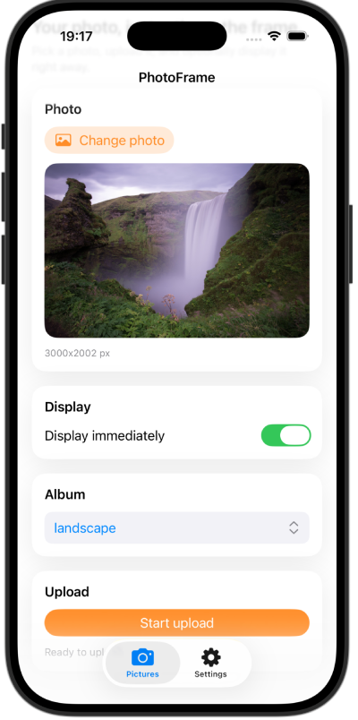
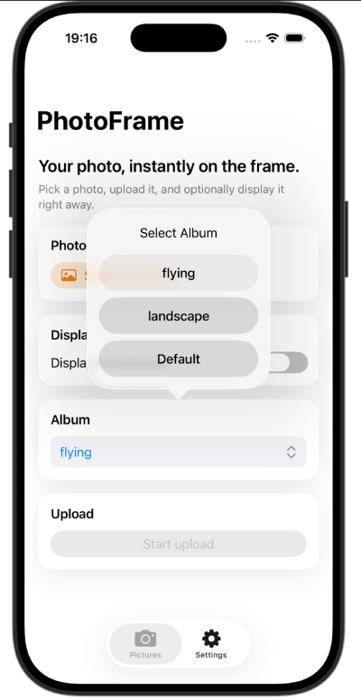

# PhotoFrameUploader iOS App for aitjcize/esp32-photoframe

PhotoFrameUploader is a minimalist iOS companion app for uploading photos to a Waveshare ESP32-S3-PhotoPainter running the `aitjcize/esp32-photoframe` firmware. It focuses on a frictionless flow: pick a photo, optionally display it immediately, and manage target albums from the device API.

The app assumes the PhotoFrame firmware is already installed and connected to Wi-Fi. For firmware setup, flashing instructions, and device details, see the original repository:
- https://github.com/aitjcize/esp32-photoframe

## Screenshots

